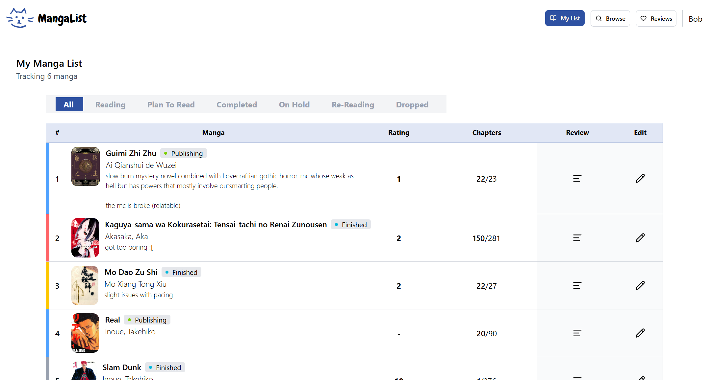
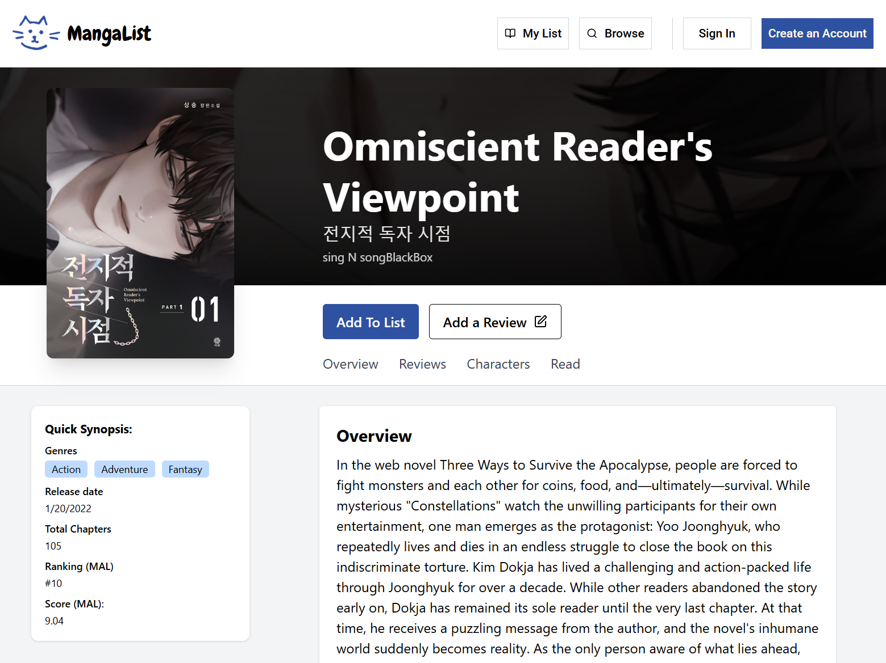
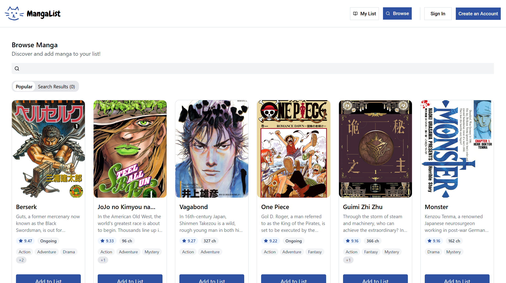

# Manga-Tracker

This project was created because the most famous animanga list platform, MyAnimeList (MAL), is often slow when pulling up lists and the UI feels outdated. I built this to have a faster and cleaner alternative for me and my community of friends who are major manga enthusiasts.

## Images:

  

  

  

### Built With

MangaList was built with the following frameworks and libraries:

- React
- Express.js

### Forking this Project

To activate the server, go to terminal and type

> nodemon server.js

To run the frontend, type

> npm run dev
